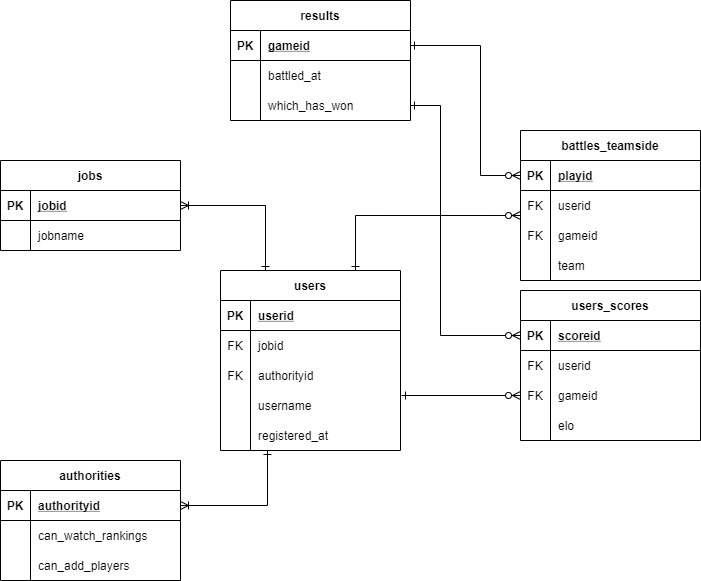

# 身内戦のELOレーティング

## DB設計
(少し変更しているので後ほど差し替え)

## プログラム設計

1. ユーザ登録  
Discordからbot経由でユーザー情報を入力する(ユーザー名、職)。  
↓
usersにINSERT。  

2. 戦績登録  
Discordからbot経由で試合結果(ユーザー名 x 6, 勝利陣営)を登録する。  
基本的にユーザー登録時に権限付与して、投稿できるユーザーを限定。
↓  
battles_teamsideとresultsにINSERT。  
users_scoresから最新のELOを取得しPython上で計算。  
 → 計算が終わったらusers_scoresにINSERT。  
実施後のELO値を出力しても良い。  

3. 戦績表示  
Discordからリクエストを送信し、要求に応じた情報を出力  
(画像出力？ホントはHTMLで吐けるといいけど、一旦pass)  
基本的にユーザー登録時に権限付与して、見れる範囲を設定。  

   1. 個人戦績出力  
   現在のELO、過去の勝敗数、(ELO時間変化)  
   2. 全体戦績ランキング出力  
   ELOランキング、職別ELOランキング。  
   3. チーム構成出力  
   試合予定のチーム構成と各ELO、平均ELO。  

## 懸念点

- 違うユーザー名で登録してしまった場合はどうするか？  
本人だけ登録できる形にして、APIで引き出せるか？←ただこれってだいぶ手間だよね  
部分一致で探す→見つからなければ追加するで大体は網羅できそう。  
画像認識は読み取り精度の問題があるので避けたい。(実装するならばcloud visionによるOCR & あいまい検索)  

- ↑のような理由で再計算になった場合どうする？  
再計算にならない仕組みは実現できるか？出来なければテーブル切り直して再計算。

- RAWDATAを見たいときが存在する？  
その場合はCSV出力機能が必要？ → 一旦問い合わせてくれでもいい気がする。

- Guestを含む場合は？  
→~~レート1300の固定値で計算 or Guestを抜いた2名で計算~~
要請でGuestもユーザー登録する方針に変更
